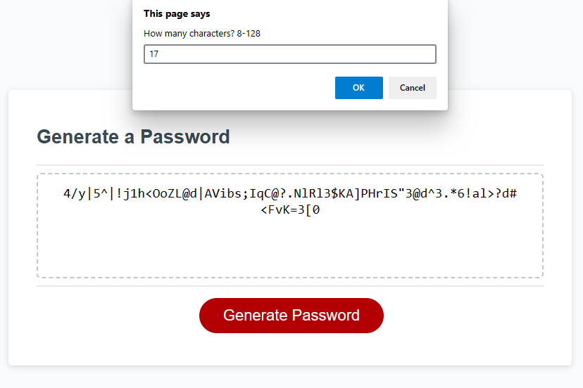

# Password Generator

## Description

This site provides a browser-based solution via JavaScript for generating random passwords following various rules. Length and character types can be specified, and at least one of each selected character type will be included in the output.

## Installation

N/A

## Usage

Click "Generate Password" to begin the process. You will be prompted to provide a length for the new password, and asked a sequence of yes/no questions for whether to include each of the following character types: lowercase letters, uppercase letters, numeric characters, and special characters. Input validation will require you to select at least one type, and a valid length 8-128 (inclusive). Finally, a randomly generated password will be output to the browser for you to copy. 

To view the deployed product, visit: https://hornickjohn.github.io/password-generator/

## Credits

N/A

## License

N/A

## As-Deployed Screenshot

